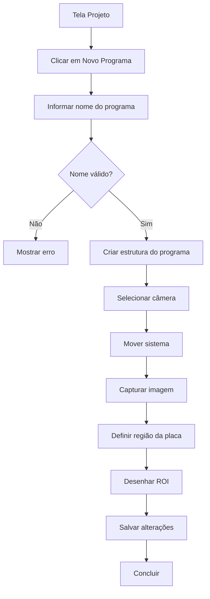

---

# 14. Fluxo criar programa

# Fluxo: Criar Programa

## Ações relacionadas

- [[acao_novo_programa|Novo Programa]]
- [[acao_capturar_imagem|Capturar Imagem]]
- [[acao_definir_regiao_placa|Definir Região da Placa]]
- [[acao_desenhar_roi|Desenhar ROI]]
- [[acao_concluir_programa|Concluir]]