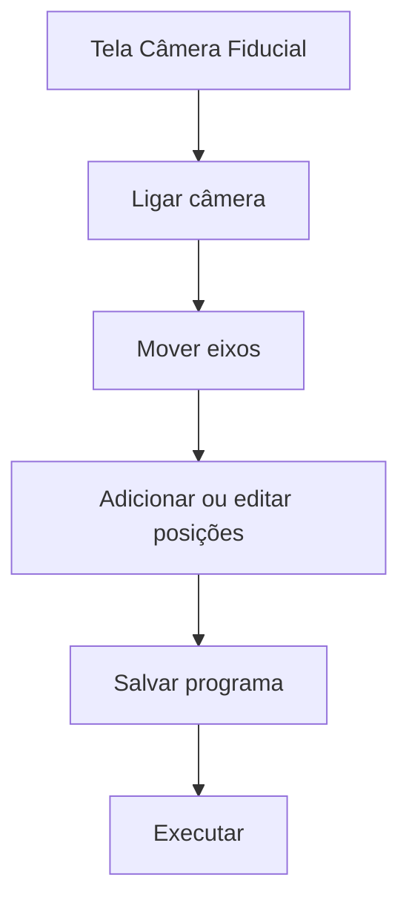

# Fluxo: Fiducial  
  

```mermaid  
flowchart TD  
  
A[Tela Câmera Fiducial] --> B[Ligar câmera]  
B --> C[Mover eixos]  
C --> D[Adicionar ou editar posições]  
D --> E[Salvar programa]  
E --> F[Executar]
```

## Ações relacionadas

- [[acao_ligar_camera_fiducial|Ligar]]
- [[acao_salvar_programa_fiducial|Salvar Programa]]
- [[acao_carregar_programa_fiducial|Carregar Programa]]