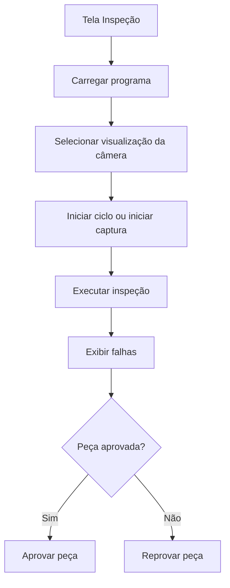

# Fluxo: Inspeção  
  

```mermaid  
flowchart TD  
  
A[Tela Inspeção] --> B[Carregar programa]  
B --> C[Selecionar visualização da câmera]  
C --> D[Iniciar ciclo ou iniciar captura]  
D --> E[Executar inspeção]  
E --> F[Exibir falhas]  
  
F --> G{Peça aprovada?}  
G -->|Sim| H[Aprovar peça]  
G -->|Não| I[Reprovar peça]
```

## Ações relacionadas

- [[acao_iniciar_ciclo|Iniciar Ciclo]]
- [[acao_inspecionar|Inspecionar]]
- [[acao_aprovar_peca|Aprovar Peça]]
- [[acao_reprovar_peca|Reprovar Peça]]