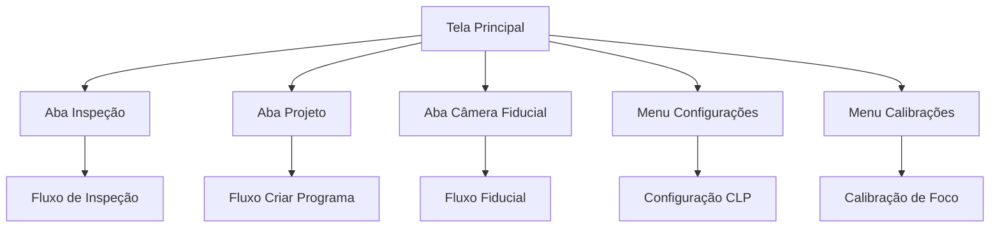

# Fluxo de Navegação Principal

```mermaid
flowchart TD

A[Tela Principal]

A --> B[Aba Inspeção]
A --> C[Aba Projeto]
A --> D[Aba Câmera Fiducial]

A --> E[Menu Configurações]
A --> F[Menu Calibrações]

E --> G[Configuração CLP]
F --> H[Calibração de Foco]

B --> I[Fluxo de Inspeção]
C --> J[Fluxo Criar Programa]
D --> K[Fluxo Fiducial]
```

## Notas relacionadas

- [[tela_inspecao|Tela Inspeção]]
- [[tela_projeto|Tela Projeto]]    
- [[tela_camera_fiducial|Tela Câmera Fiducial]]