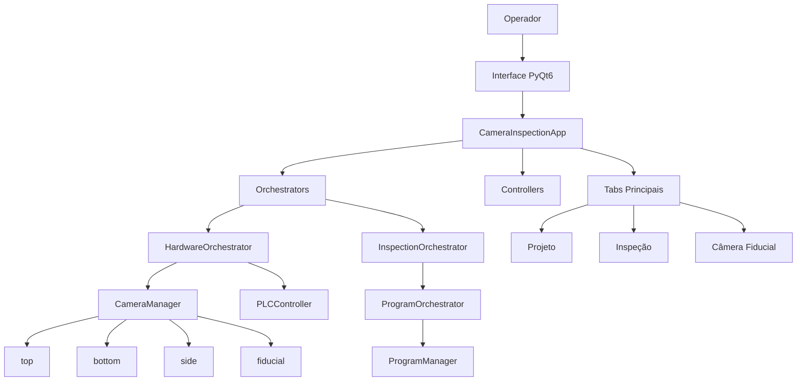

# Arquitetura do Sistema

Resumo do estado atual:

- entrada em `inspetor_main.py`
- composition root em `CameraInspectionApp`
- persistência de programas em `services/program_manager.py`
- adaptação para runtime em `orchestrator/inspection/program_orchestrator.py`
- hardware exposto por `hardware/camera_manager.py` e `hardware/plc_controller.py`
- `HardwareTestTab` mantém o `PLCController` ativo para o restante da aplicação

Referência cruzada:

- [[../estado_atual_codigo|Estado Atual do Código]]

