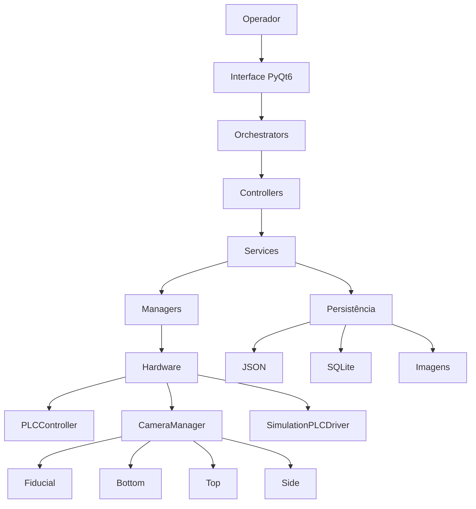

# Arquitetura do Sistema

```mermaid
flowchart TD

A[Operador] --> B[Interface PyQt6]
B --> C[Orchestrators]
C --> D[Controllers]
D --> E[Services]
E --> F[Managers]
F --> G[Hardware]
E --> H[Persistência]

G --> G1[PLCController]
G --> G2[CameraManager]
G --> G3[SimulationPLCDriver]

H --> H1[JSON]
H --> H2[SQLite]
H --> H3[Imagens]

G2 --> C1[Fiducial]
G2 --> C2[Bottom]
G2 --> C3[Top]
G2 --> C4[Side]
```