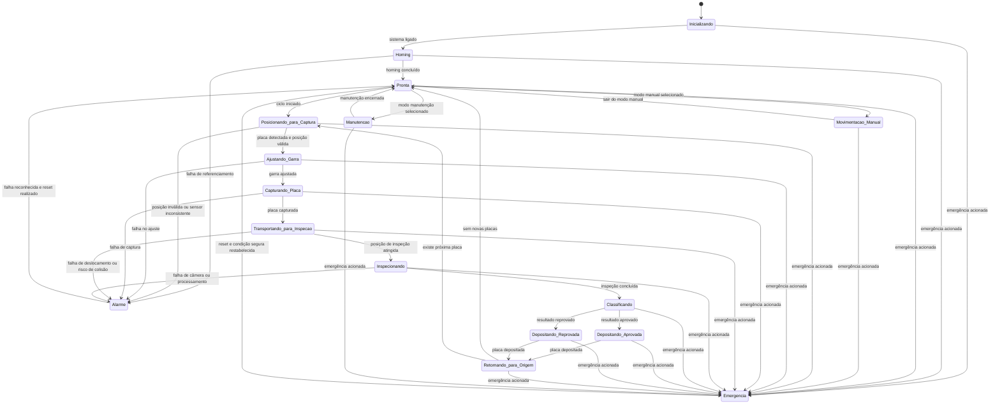

# Diagrama de Estados da Máquina

## Objetivo

Descrever os estados principais de operação da Inspetora de Periféricos, servindo como base para implementação da lógica de controle no CLP, da interface de operação em Python e da integração com visão computacional.

---

# Descrição dos Estados

<strong>Inicializando</strong>

Estado executado no momento em que a máquina é energizada e seus módulos começam a ser carregados.

Durante esse estado o sistema inicializa:

- CLP
- Interface Python
- Câmeras
- Sensores

Após a inicialização completa, o sistema transita para o estado de **Homing**.

<strong>Homing</strong>

Estado responsável pelo referenciamento dos eixos X, Y e Z.

Nesse processo a máquina movimenta os eixos até encontrar seus sensores de referência para estabelecer a posição zero do sistema.

Caso ocorra falha de referenciamento, o sistema entra em estado de **Alarme**.

<strong>Pronta</strong>

Estado de espera da máquina.

A máquina permanece aguardando:

- início de ciclo automático
- ativação de modo manual
- entrada em modo manutenção

<strong>Movimentação Manual</strong>

Permite ao operador mover manualmente os eixos:

- X
- Y
- Z

Esse modo é utilizado para:

- setup
- calibração
- manutenção
- testes

<strong>Posicionando para Captura</strong>

A máquina desloca os eixos até a posição da próxima placa na bandeja de entrada.

A posição da placa pode ser validada através da câmera de alinhamento (fiducial).

<strong>Ajustando Garra</strong>

A garra ajusta sua abertura de acordo com a dimensão da placa detectada.

Esse ajuste pode utilizar:

- parâmetros definidos
- informações obtidas pela câmera de alinhamento

<strong>Capturando Placa</strong>

A garra realiza a captura física da placa.

Após o fechamento da garra, sensores ou validações devem confirmar que a placa foi capturada corretamente.

Caso a captura falhe, o sistema pode entrar em **Alarme**.

<strong>Transportando para Inspeção</strong>

A placa capturada é transportada até a posição das câmeras de inspeção.

Esse movimento envolve deslocamentos controlados nos eixos:

- X
- Y
- Z

Os limites de segurança devem ser respeitados para evitar colisões.

<strong>Inspecionando</strong>

As câmeras capturam imagens da placa.

O sistema de visão computacional executa a análise dos periféricos para verificar:

- presença
- posicionamento
- possíveis falhas de montagem

<strong>Classificando</strong>

O resultado da inspeção é interpretado pelo sistema.

A placa é classificada como:

- **Aprovada**
- **Reprovada**

Essa decisão define o destino da placa.

<strong>Depositando Aprovada</strong>

A placa classificada como aprovada é transportada até a bandeja de saída destinada às placas aprovadas.

Após a deposição, a garra é liberada.

<strong>Depositando Reprovada</strong>

A placa classificada como reprovada é transportada até a bandeja de saída destinada às placas reprovadas.

Esse processo permite separar automaticamente peças com defeito.

<strong>Retornando para Origem</strong>

A garra retorna para uma posição segura ou para a posição inicial de captura.

Se ainda houver placas disponíveis, o ciclo de inspeção recomeça.

<strong>Alarme</strong>

Estado acionado quando ocorre uma falha operacional.

Exemplos:

- falha de sensor
- erro de captura
- falha de movimentação
- erro de visão computacional

A máquina permanece parada até intervenção do operador.

<strong>Emergência</strong>

Estado acionado quando ocorre uma condição crítica de segurança.

Exemplos:

- botão de emergência pressionado
- colisão detectada
- risco ao operador

Todos os movimentos devem ser imediatamente interrompidos.

<strong>Manutenção</strong>

Estado destinado a intervenções técnicas.

Permite:

- calibração
- testes
- ajustes mecânicos
- validação de sensores

---

## Diagrama Mermaid

---  

## Relação com os Estados Existentes no Código

O projeto modelo já possui enumeração central de estados em:

- `enums/cycle_state.py`

Os estados existentes no código incluem tanto estados de alto nível quanto estados operacionais, como:

- `IDLE`
- `VERIFICAR_PRE_CONDICOES`
- `VALIDAR_BANDEJA`
- `PICKUP_ENTRADA`
- `CAPTURA`
- `INSPECIONAR`
- `DECIDIR`
- `PLACE_OK`
- `PLACE_NG`
- `REGISTRAR`
- `LOADING`
- `POSITIONING`
- `FOCUSING`
- `CAPTURING`
- `INSPECTING`
- `DECIDING`
- `DEPOSITING_OK`
- `DEPOSITING_REJECT`
- `COMPLETE`
- `PAUSED`
- `ERROR`

Assim, temos aqui a representação de uma visão conceitual da máquina, enquanto o enum do projeto representa a visão operacional já implementada no software.
# Documentos Relacionados  
  
- [[visão_geral|Visão Geral]]  
- [[arquitetura_sistema|Arquitetura do Sistema]]  
- [[fluxograma_operacao|Fluxograma de Operação]]  
- [[fluxograma_segurança|Fluxograma de Segurança]]  
- [[lógica_clp|Lógica do CLP]]  
- [[lista_sensores|Lista de Sensores]]  
- [[lista_atuadores|Lista de Atuadores]]  
- [[visão_computacional|Visão Computacional]]