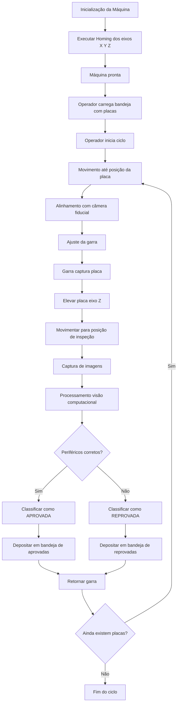

# Fluxograma de Operação da Máquina

---

## Documentos Relacionados

- [[visão_geral|Visão Geral]]
- [[arquitetura_sistema|Arquitetura do Sistema]]
- [[fluxograma_segurança|Fluxograma de Segurança]]
- [[diagrama_estados|Diagrama de Estados]]
- [[lógica_clp|Lógica do CLP]]
- [[visão_computacional|Visão Computacional]]

---

## Observação

Este fluxograma descreve a sequência funcional da máquina durante o ciclo de inspeção.

As validações de proteção e intertravamento complementares devem ser consultadas em [[fluxograma_segurança]].

A implementação dos estados de controle associados a esse fluxo está descrita em [[diagrama_estados]] e [[lógica_clp]].