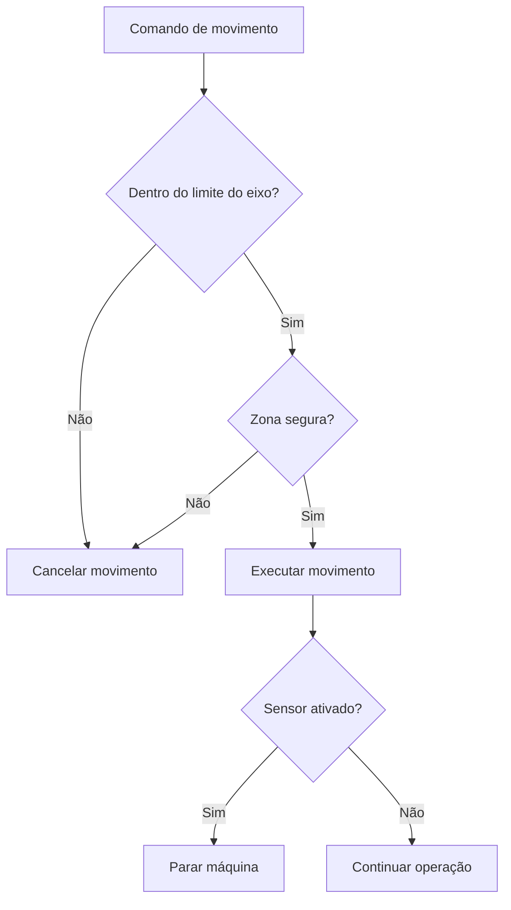

---

## Documentos Relacionados

- [[fluxograma_operacao|Fluxograma de Operação]]
- [[diagrama_estados|Diagrama de Estados]]
- [[lógica_clp|Lógica do CLP]]
- [[lista_sensores|Lista de Sensores]]
- [[lista_atuadores|Lista de Atuadores]]

---

## Observação

As funções de segurança devem atuar em conjunto com a lógica de movimento descrita em [[lógica_clp]].

Os sensores utilizados para proteção e referência estão descritos em [[lista_sensores]].

As ações de parada e bloqueio afetam diretamente os estados descritos em [[diagrama_estados]].